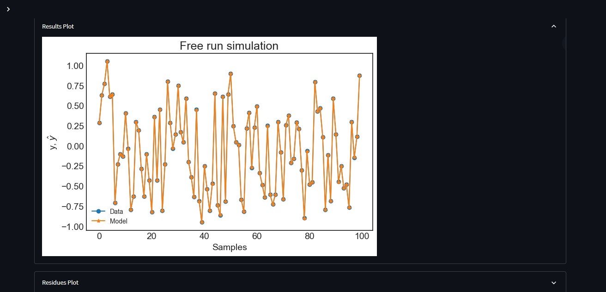

# Loading a previously identified model

After utilizing the System Identification section and saving the model on your device, you can analyze a different dataset using the previously identified model. Navigate to the **Load your model** page and follow the steps to load the model file you downloaded earlier. Then, upload the new input and output datasets that you wish to use with the model.

After successfully loading all the required files, you will find the list of regressors and their parameters, along with the metrics table, results plot, and residues plot relevant to your new dataset displayed below.

