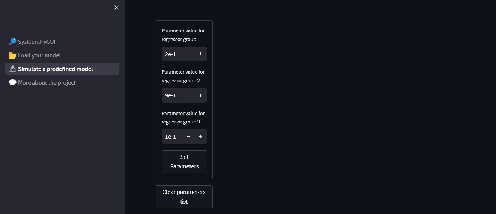
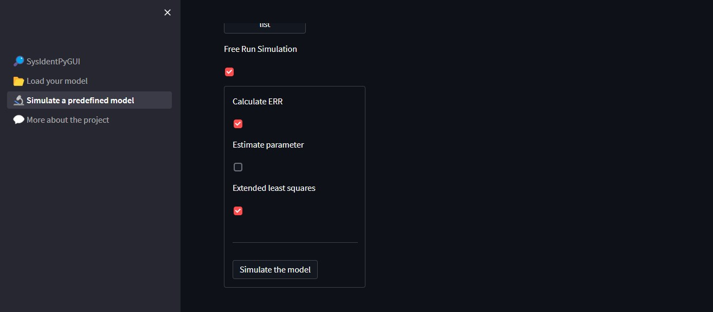

# Simulating a predefined model

It might happen that the user has a NARMAX model equation that represents a phenomenum and would like to test a dataset in this scenario. This task can be easily performed using the **Simulate a predefined model** page through SysIdentPy's regressors codification.

> **_NOTE:_**  More information about the regressors codification and the parameters that can be set in the simulation page can be found in the [***SysIdentPy Documentation***](http://sysidentpy.org/).

First, load your dataset for the input and output.

Then proceed to set the nonlinear degree of your model and input the regressors list, each set at a time.

Enter the values for the parameters for each regressors set.

Configure the simulation and then click 'Simulate the model'.

The model equation that you entered will be displayed, and the metrics, results and residues plots will be shown, like in the other pages.

