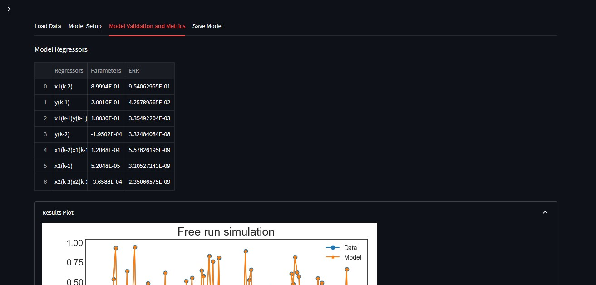

# System Identification Using a MISO System (Multiple Input/Single Output)

> **_NOTE:_**  More information about the model setup parameters and its funcionalities can be found in the [***SysIdentPy Documentation***](http://sysidentpy.org/).

To identify a system using a dataset with multiple inputs and one output is really simple too. We will use a dataset with two equal inputs formatted in a .csv file, where each input is in a column.

Going to the 'Model Setup' tab, you can change the specific lags for each one of the inputs separatedly.

You can notice that the results can be visualized the same way it was for the SISO model, but the model regressors now contain elements from both the inputs.

