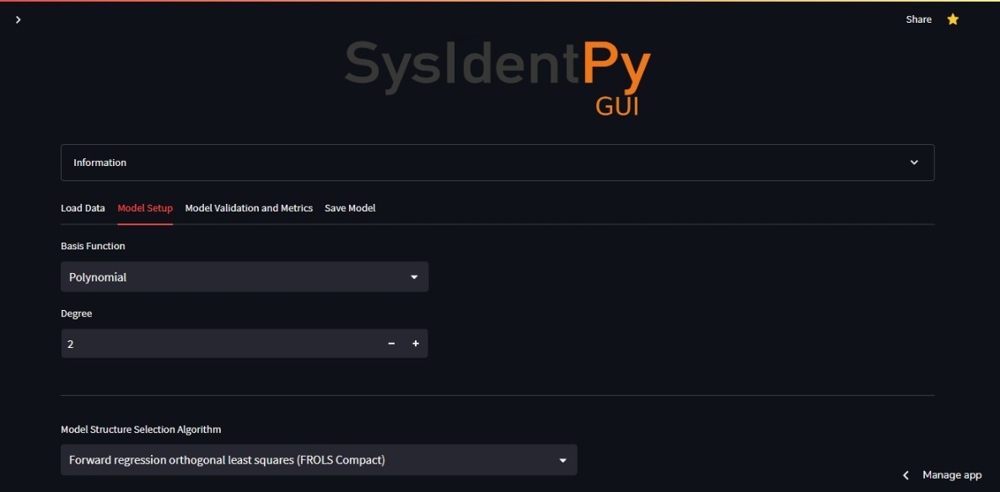
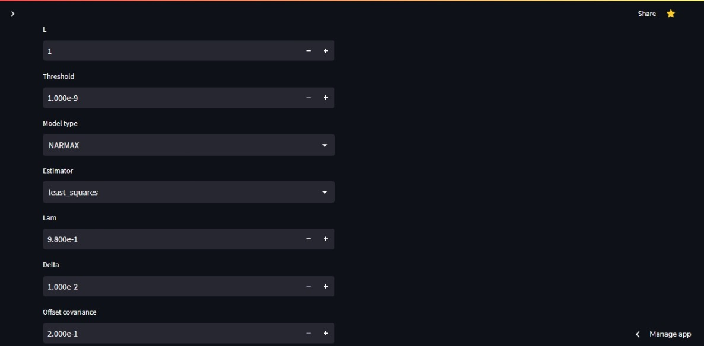
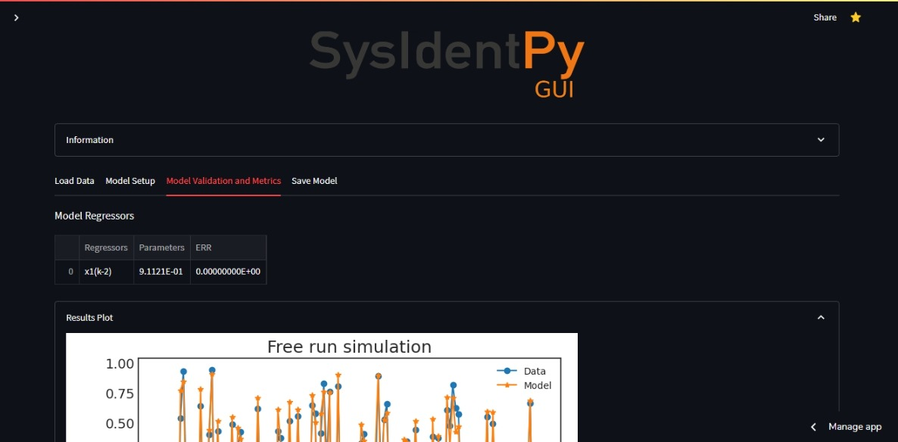
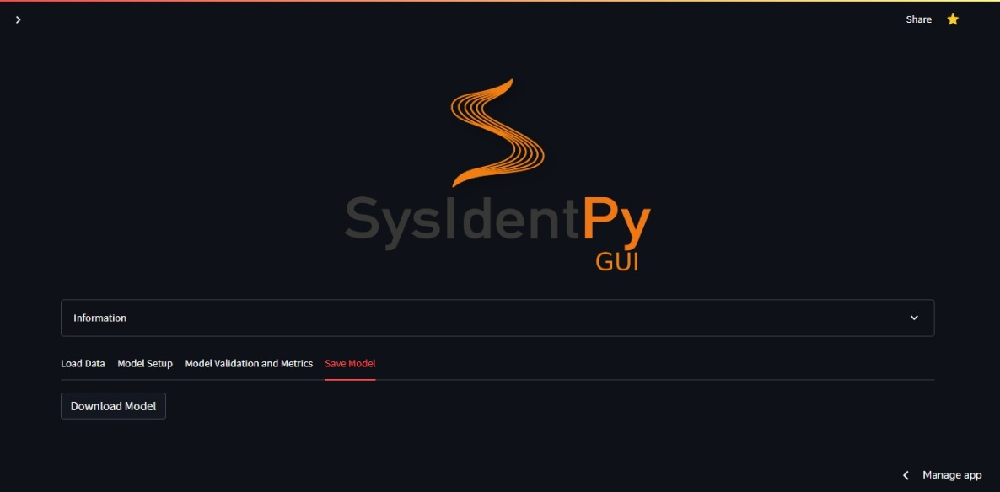

# System Identification Using a SISO System (Single Input/Single Output)

> **_NOTE:_**  More information about the model setup parameters and its funcionalities can be found in the [***SysIdentPy Documentation***](http://sysidentpy.org/).

To identify a system using a dataset with one input and one output is really easy using SysIdentPyGUI. First, in the main page (**SysIdentPyGUI**), go to the first tab ('Load Data') and load your input data and output data using headless .csv files (drag to the box or click the 'Browse files' button):

Next, you should set the percentage of data that will be used for purposes of validation later.

Moving to the next tab, 'Model Setup', the user can define the specific parameters related to the system identification process. First, the user should choose between Polynomial or Fourier basis function and set its parameters. For the sake of example, we will be using a second degree Polynomial basis function:

Going further down, the user has to decided between four model structure selection algorithms:

* Forward Regression Orthogonal Least Squares  (FROLS);
* Accelerated Orthogonal Least-Squares (AOLS);
* Meta-Model Structure Selection (MetaMSS);
* Entropic Regression (ER).

Each one of this algorithms has its specifics parameters to be set, in this example we will be using AOLS:

The user can set the maximum lag for the input and output, and then choose the specifics lags that will be used for the combinations of possible regressors. For example, below we selected the maximum output lag as 4, but we didn't select the lag k=2. And for the input, the maximum lag is 5, but we will only use the lags k=1,3,5:

Continuing down the page, we can set the model type (NARMAX, NAR or NAFIR) and set the parameter estimator algorithm:

There is a bunch of parameters for each model structure selection algorithms to be set, and for better understading of the effect of each one in the final model, the user can refer to [***SysIdentPy Documentation***](http://sysidentpy.org/). But for simplicity, the user could choose one of the compact forms from some of the four previously cited algorithms.

At the bottom of the page, the user can choose between a 'Free Run' or a 'K-Steps Ahead' simulation.

Moving to the 'Model Validation and Metrics' tab, the user gets a table with each regressor and its parameters from the final model. The number of regressors deppends of the model structure selection algorithms and each one of the previously setted parameters.

Below we have the Results plot:

The Residues plots:

And a table with the model specifics metrics:

The results with the same dataset can vary deppending of the algorithm used, the selected basis function, the choosen parameters or the type of run that is defined. So, the user could tweak the variables available for a better result.

Lastly, in the 'Save Model' tab, the user can download a file containing the data of the identified system for posterior use in the 'Load your model' page.

