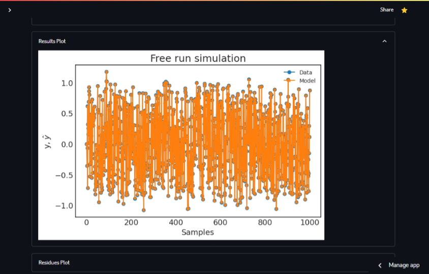
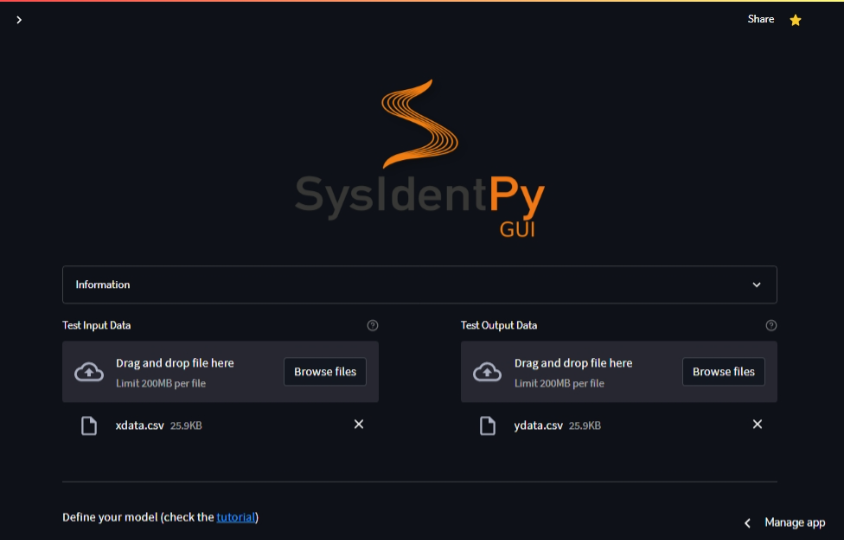
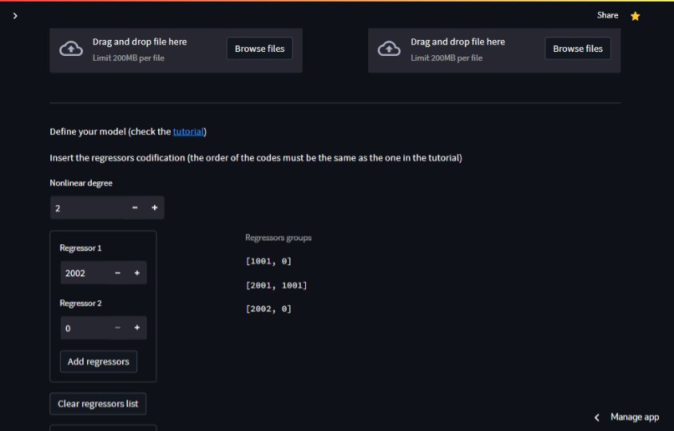
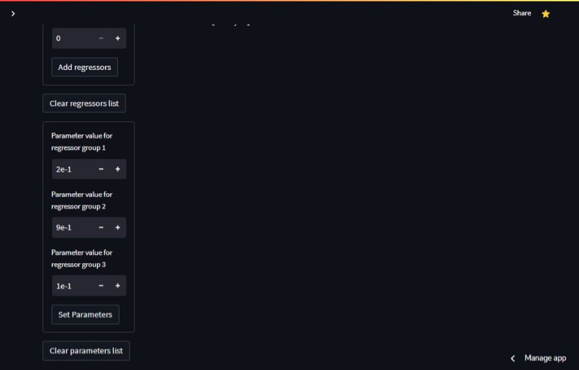
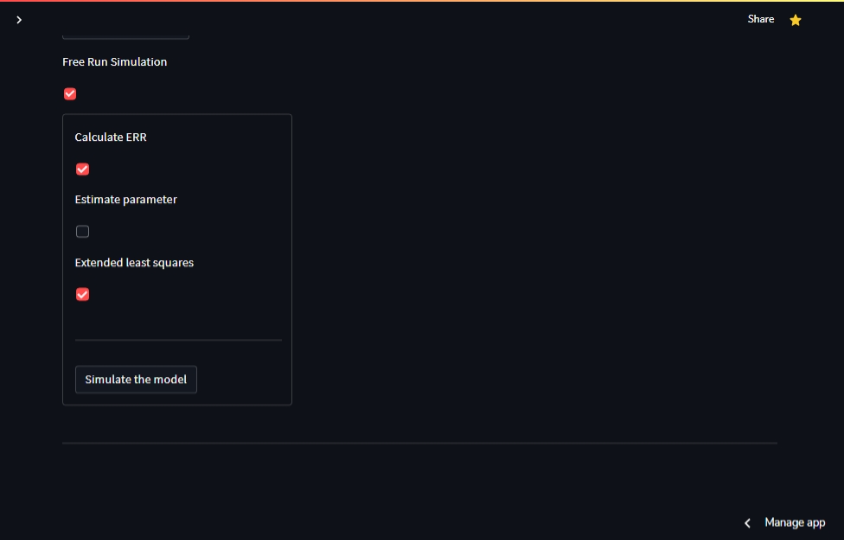
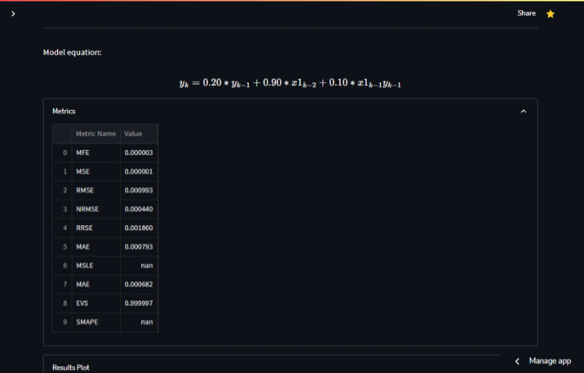
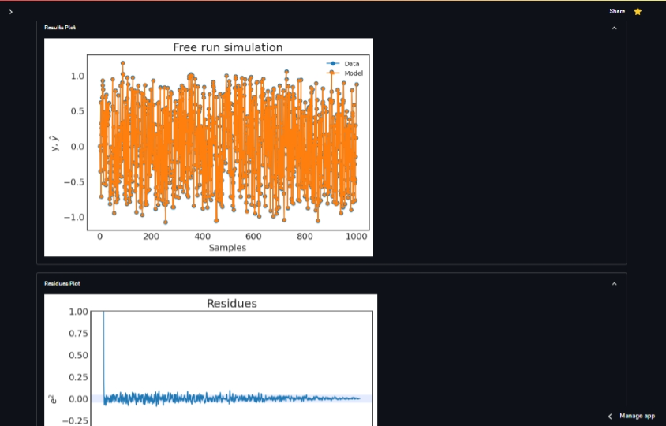

# Summary

The field of System Identification (SI) aims to construct 
mathematical models that describe the static and dynamic behavior 
of systems based on experimental data [@Lju1987]. Nonlinear 
system identification has emerged as a key topic within the SI 
community, and since the 1950s, numerous methods have been 
proposed [@ZAINOL2022106835], [@BONASSI2021547], [@MARTINS2016607], 
[@ayala2020r], [@BBWL2018]. NARMAX (Nonlinear AutoRegressive Moving 
Average with eXogenous input) models are particularly 
well-documented and widely used representations of dynamical 
systems [@Bil2013].

`SysIdentPy` [@Wil2020] is a package designed for system 
identification using polynomial NARMAX models. It has the 
capability to handle both SISO (Single-Input Single-Output) 
and MISO (Multiple-Inputs Single-Output) NARMAX model 
identification, as well as related variants such as 
NARX, NAR, ARMAX, ARX, and AR models. Additionally, 
the package provides several tools for structure selection, 
parameter estimation, and model validation. The package is 
continuously being updated and expanded with new features 
by the community, highlighting its value and importance 
in the field of system identification.

Since `SysIdentPy` is a Python programming tool, users need 
to have some experience with Python to use it effectively. 
However, to make the package more accessible to a wider range 
of users, `SysIdentPyGUI` was developed as a Graphical User 
Interface (GUI) for `SysIdentPy`. This allows any user to use 
`SysIdentPy's` outstanding functionalities without 
needing to write any line of code.

# Statement of need

`SysIdentPyGUI` is a web app for the Python module `SysIdentPy` in the format of a Graphical User Interface (GUI). It was written using the `Streamlit` library, which allows the creation of web apps in a compact Python syntax. `SysIdentPyGUI` comes as an use alternative for people that would like to use `SysIdentPy` toolbox but aren't familiar with Python, such as medical or economy students. The application currently has the following `SysIdentPy` features implemented:

- Model identification using AOLS, ER, MetaMSS and FROLS, through a Polynomial or Fourier basis function
- Download your model
- Load and validate your model
- Simulate a predefined model

# Example of usage

## Model Identification

Through `SysIdentPyGUI` you can quickly identify the mathematical model that approximates the behaviour of given data. The demonstration of this funcionality will be made using pseudorandom data generated by **sysidentpy.utils.generate_data** module on `SysIdentPy`. First, in the 'Load Data' tab, the user upload the input and output datasets from the system and adjust the percentage of data that will be used for validation later:

In the 'Model Setup' tab, the user will configurate the model: choosing between Polynomial and Fourier basis function for the representation; selecting one of the four model structure selection algorithm (Forward regression orthogonal least squares, Acelerated orthogonal least squares, Entropic regression and Meta model structure selection); setting the parameters related to each one of the cited algorithms; defining the specific lags for input and output; picking the estimators and model type to be used and lastly setting the predict options (choosing between a free run simulation or k-steps ahead simulation):

The 'Model Validation and Metrics' tab gives to the user the results of the identified system: the regressors and its parameters, the plots for results and residues, as well as the metrics (MSE, RMSE, MAE, RMSE and many others):

In the last tab, 'Save Model', is available for the user to download the fitted model for posterior analysis in the 'Load your Model' page.

## Loading a Model

In this page, the user can load the previously fitted model for new analysis. First, we upload the input and output data that will be used for validation and study. Then, the model file that was saved beforehand should also be loaded.

As soon as the model is loaded, the application will display the regressors and its parameters, metrics and the results/residues plots for the system, for the given data:

## Simulate a Predefined Model

The user can simulate a model known beforehand (regressors and parameters), using the regressors codification that is described in `SysIdentPy` documentation, you can enter a model that will be fitted with the uploaded data.

We start loading the input and output datasets into the app:

Then, we set the nonlinearity degree of the model and enter the list with the the especific regressors (each regressor group at a time):

Then, we set the parameter value for each regressor group:

The last step is configurating the fitting arguments and clicking the 'Simulate the model' button:

The aplication then outputs the model equation formated, the metrics and results/residues plots for analysis:

# Future Work

# References