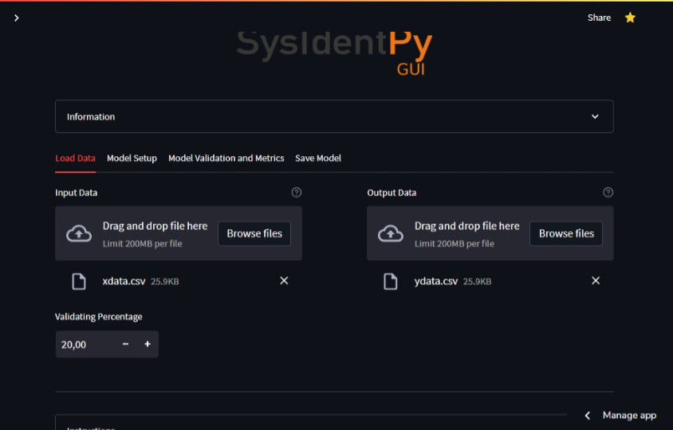
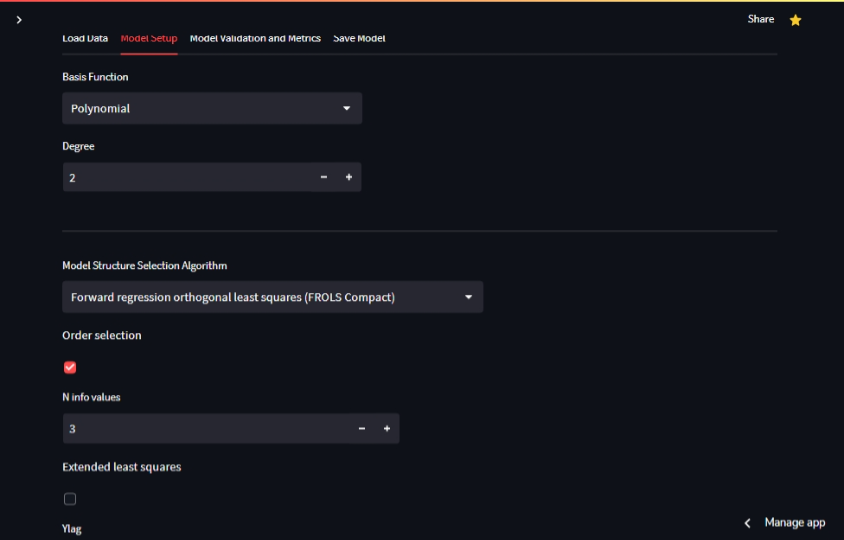
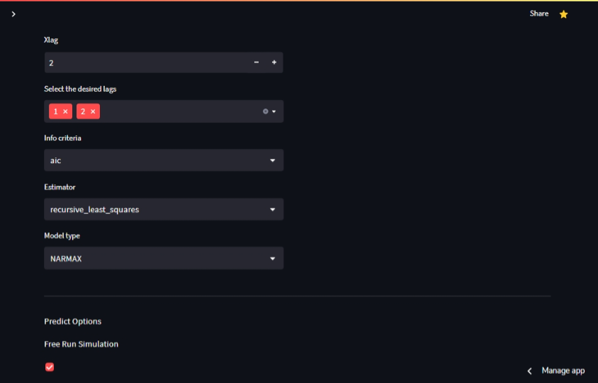
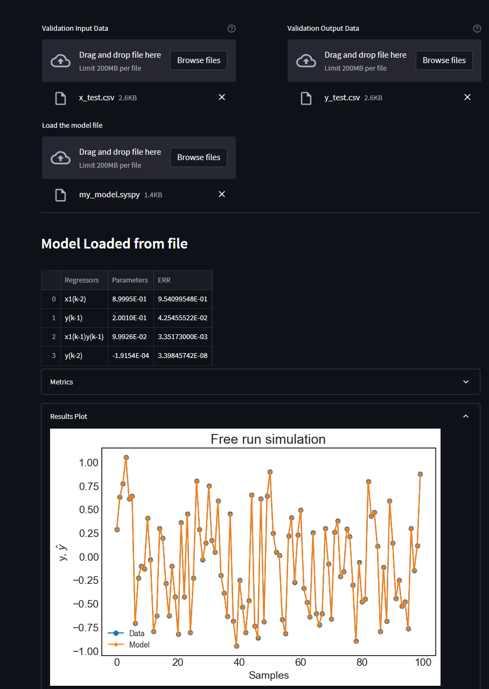
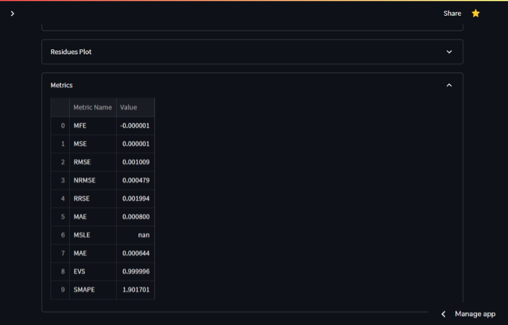
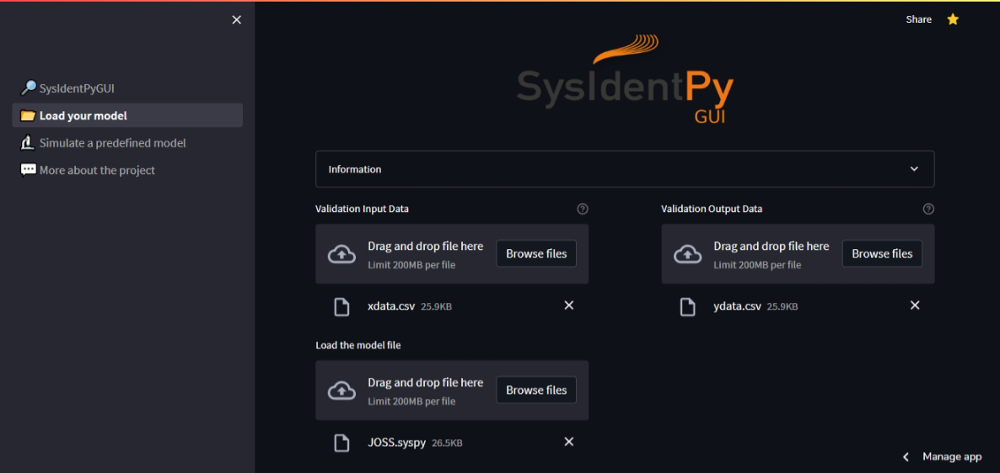

# Summary

The field of System Identification (SI) aims to construct 
mathematical models that describe the static and dynamic behavior 
of systems based on experimental data [@Lju1987]. Nonlinear 
system identification has emerged as a key topic within the SI 
community, and since the 1950s, numerous methods have been 
proposed [@ZAINOL2022106835], [@BONASSI2021547], [@MARTINS2016607], 
[@ayala2020r], [@BBWL2018]. NARMAX (Nonlinear AutoRegressive Moving 
Average with eXogenous input) models are particularly 
well-documented and widely used representations of dynamical 
systems [@Bil2013].

`SysIdentPy` [@Wil2020] is a package designed for system 
identification using polynomial NARMAX models. It has the 
capability to handle both SISO (Single-Input Single-Output) 
and MISO (Multiple-Inputs Single-Output) NARMAX model 
identification, as well as related variants such as 
NARX, NAR, ARMAX, ARX, and AR models. Additionally, 
the package provides several tools for structure selection, 
parameter estimation, and model validation. The package is 
continuously being updated and expanded with new features 
by the community, highlighting its value and importance 
in the field of system identification.

Since `SysIdentPy` is a Python programming tool, users need 
to have some experience with Python to use it effectively. 
However, to make the package more accessible to a wider range 
of users, `SysIdentPyGUI` was developed as a Graphical User 
Interface (GUI) for `SysIdentPy`. This allows any user to use 
`SysIdentPy's` outstanding functionalities without 
needing to write any line of code.

# Statement of need

`SysIdentPyGUI` is a web app for the Python module `SysIdentPy` in the form of a Graphical User Interface (GUI). It was written using the `Streamlit` library, which allows the creation of web apps in a concise Python syntax. `SysIdentPyGUI` was conceived as an alternative for people who would like to use the `SysIdentPy` toolbox but are not familiar with Python, such as medical or economics students. However, even experienced users can take advantage of its features for quick and easy use of the system identification and simulation tools, for example, using a cellphone.

Moreover, there are currently no projects available for NARX and NARMAX system identification in the form of a GUI, making it a significant contribution to the field.

The application currently implements the following features of `SysIdentPy`:

- NARX and NARMAX model identification using four model structure selection algorithms (Accelerated orthogonal least squares, Forward regression least squares, Meta model structure selection, and Entropic regression); two basis functions (Polynomial and Fourier); a variety of estimator algorithms (such as least squares, recursive least squares, and least mean squares); the ability to identify SISO and MISO models and select the specific lag for each input and output; free run and k-steps ahead simulation; an intuitive list of regressors and their parameters; results and residuals plots; a complete list of metrics to analyze the model; the ability to download a model file for future usage.
- You can use a previously generated model file to analyze a new dataset and check the specified metrics and plots.
- If the user has a known NARX model equation, they can input it into the web app and simulate the model with free run and k-steps ahead options and other parameters.

To use `SysIdentPyGUI`, the user can access the app through the hosted server, clone the repository, or run a containerized version using Docker.

Further in this article, examples of the web app's usage and future work are described, but more detailed information can also be found in the [documentation](https://jceneziojr.github.io/sysidentpygui/).

# Example of usage

## Model Identification

Through `SysIdentPyGUI`, with just a few clicks, you can quickly identify the mathematical model that approximates the behavior of the given data. First, you upload your data, set the parameters in the `Model Setup` (or you can tweak them using the default values until you obtain a decent prediction), and finally, you can analyze your results.

## Loading a model

If the user has saved the model on their computer, they can load it and use another dataset to analyze the model fitting.

## Simulate a Predefined Model

The user can simulate a pre-known NARX model (with regressors and parameters) using the regressor encoding described in the `SysIdentPy` documentation. It's as simple as loading the data, inputting the regressor list, setting the regressor parameters, and configuring the simulation.

# Future Work

`SysIdentPyGUI` aims to be as self-maintaining as possible and to stay up-to-date compared to `SysIdentPy`. However, some features, such as the Narx Neural Network, are not yet available. Nevertheless, they will be analyzed and deployed in due course, along with any new features developed in the package.

# References